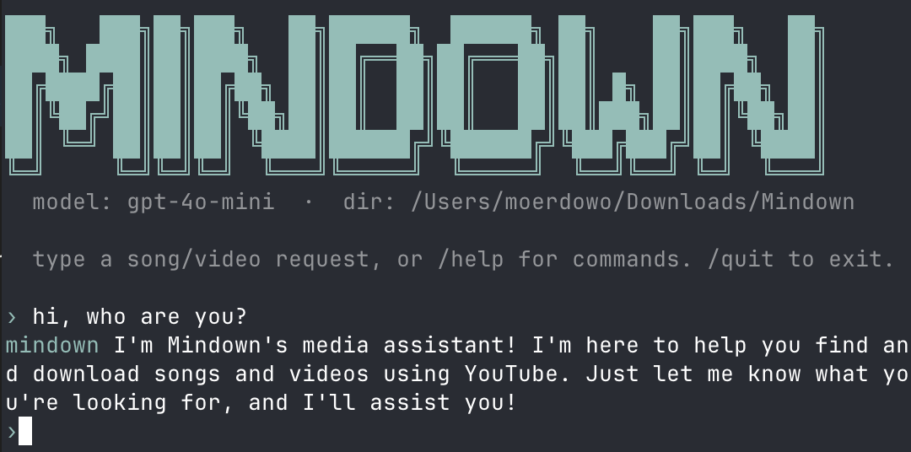

# mindown-cli

Terminal version of [mindown](https://github.com/moerdowo/mindown) — chat with
an OpenAI-compatible model to find and download songs / videos via `yt-dlp`,
with automatic ID3 / iTunes-atom tagging (cover art + LRCLib lyrics) on every
audio file.



## Requirements

- Python 3.9+
- [`yt-dlp`](https://github.com/yt-dlp/yt-dlp) on your `$PATH` (or supply a
  full path during setup)
- [`ffmpeg`](https://ffmpeg.org/) on your `$PATH` (used for audio extraction
  and metadata write-back)
- An OpenAI-compatible API key — works with OpenAI, OpenRouter, Groq,
  Together, Anthropic via gateway, local Ollama in OpenAI mode, etc.

On macOS:

```bash
brew install yt-dlp ffmpeg
```

## Install

```bash
pip install -e .
```

This installs a `mindown` command. The package is pure stdlib — no extra
Python deps are required.

## First run

```bash
$ mindown
Welcome to Mindown CLI.
Chat-driven YouTube → mp3/mp4 downloader with iTunes + LRCLib tagging.

OpenAI-compatible API key: ********
Base URL [https://api.openai.com/v1]:
Model [gpt-4o-mini]:
yt-dlp path [/opt/homebrew/bin/yt-dlp]:
ffmpeg path [/opt/homebrew/bin/ffmpeg]:
Download directory [~/Downloads/Mindown]:
✓ Saved config to ~/.config/mindown-cli/config.json
```

The config is written to `~/.config/mindown-cli/config.json` (or
`$XDG_CONFIG_HOME/mindown-cli/config.json`) with mode `0600` because it
holds the API key. Re-run setup with `mindown --config`.

## How it works

1. Your message is sent to the chat model along with two tool definitions:
   - `search_youtube(query, limit)` — runs `yt-dlp ytsearch:` and returns
     up to 10 candidate videos.
   - `propose_downloads(items[])` — surfaces a list of `{url, format,
     quality}` proposals for you to approve.
2. The model picks queries, fetches candidates, then proposes a list. You
   tick / un-tick items at the prompt; nothing downloads automatically.
3. Approved items are downloaded sequentially with `yt-dlp`, with a live
   progress bar parsing yt-dlp's `--progress-template` output.
4. For audio downloads, the file is run through a tagging pass:
   - iTunes Search API → title, artist, album, year, genre, track #, cover
     art (1200×1200), composer, copyright (via album lookup).
   - LRCLib → plain-text lyrics (USLT / `©lyr`).
   - Optional **AI lyrics fallback** — when LRCLib has no match, ask
     the configured chat model for the lyrics and write them into the
     same USLT / `©lyr` field. Off by default; opt in during first-run
     setup, with `/ailyrics on` in the REPL, or `--ai-lyrics` on the
     command line. Some models refuse on copyright grounds, in which
     case nothing is written.
   - `ffmpeg` rewrites the file in place with ID3v2.3 / iTunes atoms.

## Slash commands

```
/help              show command list
/config            re-run setup
/show              print current config (API key redacted)
/reset             clear chat history
/dir <path>        change download directory
/model <name>      switch model
/tag on|off        toggle iTunes tag enrichment
/ailyrics on|off   toggle the AI lyrics fallback
/quit              exit
```

## Examples

```
› anti-hero by taylor swift as mp3
› bohemian rhapsody music video as mp4 1080p
› top 5 radiohead songs
› daft punk - around the world as wav
```

## Non-interactive / scripted use

Pass a single prompt with `-p` / `--prompt` and the CLI runs once,
auto-approves every download the AI proposes, and exits — no REPL, no
approval prompts. Handy for cron, pipelines, or one-off scripts.

```bash
mindown -p "anti-hero by taylor swift as mp3"
mindown -p "top 5 radiohead songs"
mindown --prompt "bohemian rhapsody music video as mp4 1080p"
mindown --ai-lyrics -p "blackbird by the beatles as mp3"   # use AI for lyrics
mindown --first -p "blinding lights"                       # only 1 song
```

Add `--first` to any of these to keep just the first item the model
proposes from each turn and skip the rest. Useful when you want a
prompt like `"blinding lights"` to resolve to exactly one download
even if the model gathered candidates.

The banner is only shown in interactive mode — `--prompt` runs are
banner-free out of the box, so they pipe cleanly into logs.

Inside the interactive REPL, pass `-y` / `--yes` to skip every approval
prompt while still keeping the chat:

```bash
mindown -y
```

Suppress the REPL banner with `--no-banner` if you prefer.

## Use with AI agents

This repo ships a [`SKILL.md`](SKILL.md) that briefs AI agents on how
to drive `mindown` autonomously — prerequisites, the
`mindown -p "..."` invocation pattern, intent → flag mapping
(`--first`, `--ai-lyrics`, …), output parsing, failure modes, and
safety rules ("never run `mindown --config` from an agent").

### Claude Code

User-level (available in every session, on any project):

```bash
mkdir -p ~/.claude/skills/mindown-cli
ln -s "$PWD/SKILL.md" ~/.claude/skills/mindown-cli/SKILL.md
```

(Use `cp` instead of `ln -s` if you'd rather pin a snapshot.)

Project-level (only loads when Claude Code runs inside a specific
repo — useful if you want the skill scoped to one workspace):

```bash
cd /path/to/your/project
mkdir -p .claude/skills/mindown-cli
ln -s /absolute/path/to/mindown-cli/SKILL.md .claude/skills/mindown-cli/SKILL.md
```

Restart Claude Code (or run `/skills` to refresh) and the agent will
pick up the skill on its next prompt-router pass. You can verify
it's loaded with `/skills` — `mindown-cli` should appear in the list.

### Cursor / Continue / other agentic IDEs

Most agentic IDEs honour the same `.claude/skills/<name>/SKILL.md`
convention; some additionally read `.cursor/rules/` or similar. Check
your IDE's docs and either symlink or copy `SKILL.md` into the right
directory.

### Claude Agent SDK / custom agents

`SKILL.md` is plain Markdown with YAML frontmatter. Load it into the
agent's system prompt or pass it as a tool spec — the `description`
field in the frontmatter is the trigger string the routing layer
matches against, and the body is the operating manual the agent
follows once activated.

```python
from pathlib import Path
skill = Path("SKILL.md").read_text()
# include `skill` in your system prompt or skill registry
```

### Verifying the agent can drive it

```bash
# Pre-flight: skill prereqs
mindown --show           # config exists?
which yt-dlp ffmpeg      # binaries on PATH?

# Sanity test the agent's primary call shape
mindown --first -p "anti-hero by taylor swift"
```

If both pre-flight checks pass, agents reading `SKILL.md` should be
able to run `mindown -p "..."` invocations end-to-end without further
hand-holding.

## Notes

- Audio defaults to MP3 best quality. Video defaults to MP4 1080p when
  asked for video; otherwise audio is chosen.
- `--no-playlist` is enforced — paste a `/watch?v=…` URL inside a playlist
  and only that single video downloads.
- yt-dlp's progress is parsed from a structured `DL|...` template line, so
  the progress bar is robust against locale formatting differences in the
  classic `[download]` output.
- Output files are named `%(title).200B [%(id)s].%(ext)s` so duplicate
  titles do not clobber each other.

## License

Personal-use utility, no warranty. yt-dlp and ffmpeg are redistributed
under their respective licenses.
